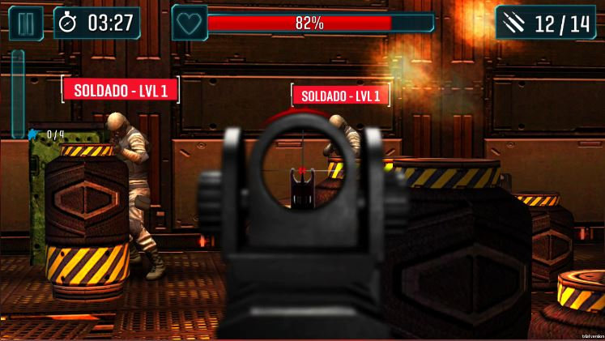

# Kill'em All (PS4)

## Very important!!

### How to control it?

#### In the User Interface
Kill'em All is a game with a very extensive GUI. So the best option for PS4 to manage this is using the DualShock touchpad as a mouse. 

1.- So when you've got to interact with the User Interface just move your finger on top of the touchpad. You will see a magic icon appears on the screen.

2.-Drag your finger over the touchpad until you reach the button or item you want to select.

3.- Remove a bit your finger from the touchpad. This effect makes the item be selected. You will see how its look changes.

4.- Finally press the touchpad. It is the click simulation.

So, move your finger on to the button, remove your finger a bit, then press touchpad.

#### In the gameplay

For the gameplay you will use the Right Stick to look around and AIM.

R1 for doing ZOOM, and quit ZOOM.
R2 for shooting.

DPad.
Left => Change to the left cover.
Right => Change to the right cover.

That's all.

I will put here images to explain it better in a few.

